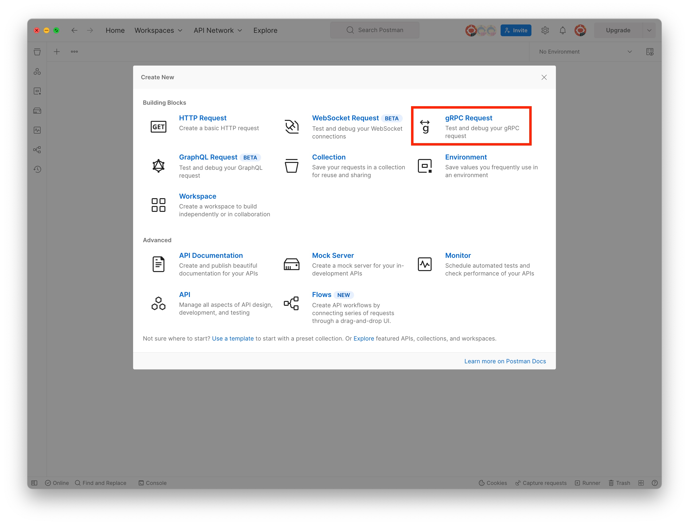
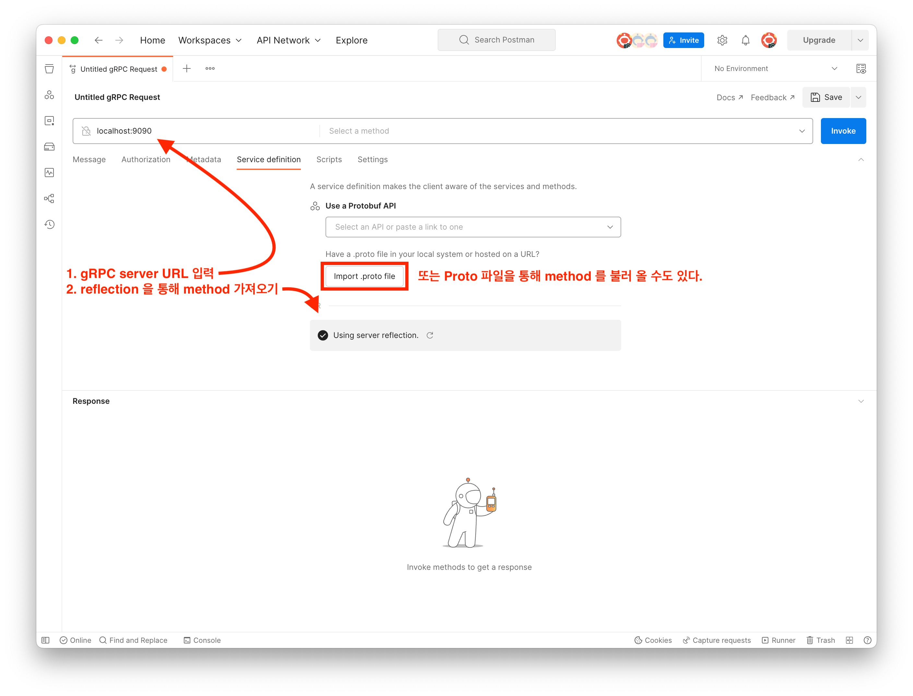
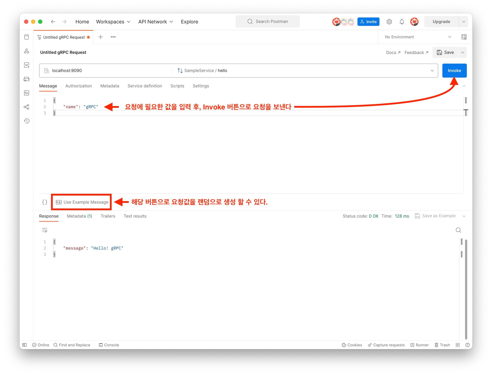

# gRPC hands-on
gRPC<sub>Google Remote Procedure Call</sub> 는 Google 에서 만든 RPC 시스템이다. 

## 들어가기 전
gRPC 를 알기위해 `RPC`와 `HTTP 2.0`에 대한 이해가 필요하다.

### RPC <sub>Remote Procedure Call</sub>
 RPC는 말 그대로 네트워크 내부의 다른 서버의 프로시저를 원격으로 호출하는 기능이다. 
통신이나 call 방식에 신경쓰지 않고 원격지의 자원을 사용할 수 있다는 장점이 있다. 
또한 `IDL`<sup>1</sup> 기반으로 다양한 언어를 가진 환경에서도 쉽게 확장이 가능하다.   

 RPC의 핵심 개념은 `Stub`이라는 것이다. Server 와 Client 는 함수 호출에 사용된 매개변수를 변환해야한다.
이를 담당하는 것이 Stub 이다. Stub 의 동작 방식은 다음과 같다.
 ```
1. IDL 을 사용, 호출 규약 정의
  - IDL 파일을 rpcgen 으로 컴파일 시 Stub Code 가 생성됨.
2. Stub Code 에 명시된 함수는 원시코드로, 상세 기능은 Server 에서 구현
  - Stub Code 는 Client, Server 에 함께 빌드.
3. Client Stub 은 RPC runtime 을 통해 함수 호출.
5. Server 는 수신된 Procedure 처리 후 결과 값 반환.
6. Client 는 결과 수신, 함수를 Local에 있는 것 처럼 사용 가능.
 ```

 단, RPC 는 쉽게 찾아 볼 수 없다. RPC 는 상당히 획기적인 방법론이지만, 
 구현이 어렵고 지원 기능의 한계 등.. 이 있었기 때문에 활용이 제대로 되지 않았다.
대신 이 자리를 REST 가 차지하게된다.

> <sup>1</sup> IDL <sub>Interface Definication Language</sub>   
> Server 와 Client 가 서로 정보를 주고 받는 규칙이 프로토콜이라면, IDL 은 정보를 저장하는 규칙이다.   
> 어떤 언어로 작성 된 프로그램 또는 객체가, 다른 알려지지 않은 언어로 작성된 프로그램과 통신 살 수 있도록 해준다.   
>    
> <sub> * ref: <a> http://www.terms.co.kr/IDL.htm </a></sub>

### HTTP 2.0
HTTP2.0은 HTTP1.1의 프로토콜을 계승해 동일한 API 면서 성능 향상에 초점을 맞추었다.

HTTP 1.1 은 기본적으로 클라이언트의 요청이 올때만 서버가 응답을 하는 구조로 매 요청마다 connection 을 생성해야만 한다. 
따라서 RTT<sub>Round Trip Time</sub><sup>1</sup> 과 같은 문제가 발생하며, 
메타 정보들을 저장하는 무거운 header 가 요청마다 중복 전달되어 비효율적이며 느린 속도를 보여주었다.

HTTP 2.0 에서는 아래와 같은 방법을 통해 성능을 향상하였다.

- Multiplexed Streams   
  - 한 connection으로 동시에 여러개의 메시지를 주고 받을 수 있다.
  - Response는 순서에 상관없이 Steram 으로 받는다.
  - Stream Prioritization
    - 리소스 간 우선순위를 설정해 Client 가 먼저 필요한 리소스부터 보내줄 수 있다.
- Server Push
  - Server 는 Client 가 요청하지 않은 리소스를 마음대로 보내줄 수 있다.
- Header Compression
  - HPACK 압축방식을 통해 Header 를 압축하여 중복 제거 후 전달

> **외전**   
> HTTP 1.1 에서 동시전송 문제와 다수 리소스를 처리하기 위해 `Pipelining`이 제안되었다.   
> 
> HTTP 1.0 의 동작은 2개의 요청을 보낼 때, `요청(1)->응답(1)->요청(2)->응답(2)` 와 하나의 요청이 다 끝나야 다음 요청을 보낼 수 있었다.
>    
> 반면, Pipelining 을 사용할 경우 `요청(1)->요청(2)->응답(1)->응답(2)` 와 같은 형식으로 
> 요청에 대한 응답을 받지 않아도 여러개의 요청을 하나의 TCP/IP Pakcet 으로 Packing 할 수 있다.   
>    
> 하지만 이러한 Pipelining 에도 HOLB<sub>Head Of Line Blocking</sub> 등.. 과 같은 문제가 발생 한다.   
> ** HOLB<sub>Head Of Line Blocking</sub> : 만약 첫번째 응답이 지연되면, 이후 두번째, 세번째 응답도 같이 지연되는 문제이다.

> <sup>1</sup>RTT<sub>Round Trip Time</sub>   
> HTTP 1.1 은 하나의 Connection, 하나의 요청으로 작동하기 때문에 Connection 을 생성 할 때 마다 TCP 연결을 하게된다.
> TCP Connection 은 시작 시 3-way handshake, 종료 시 4-way handshake 를 진행하게되기 때문에 이로 인한 오버헤드가 발생한다.

## Getting Started
실습은 [grpc-spring-boot-starter](https://github.com/yidongnan/grpc-spring-boot-starter) 를 사용하였으며, 
이 외에도 line 에서 제작 한 [Armeria](https://github.com/line/armeria) 를 사용하여 gRPC server 를 구성 할 수도 있다.   
   
### Interface
Interface 모듈은 proto 파일을 java 파일로 변환하는 작업을 수행한다. 

**Dependency**
``` gradle
dependencies {
  implementation ("io.grpc:grpc-protobuf:1.39.0")
  implementation ("io.grpc:grpc-stub:1.39.0")
  ...
}

sourceSets{
    getByName("main"){
        java {
            srcDirs(
                "build/generated/source/proto/main/grpc",
                "build/generated/source/proto/main/java",
                "build/generated/source/proto/main/kotlin"
            )
        }
    }
}

protobuf {
    protoc {
        artifact = "com.google.protobuf:protoc:3.17.3"
    }
    plugins {
        id("grpc") {
            artifact = "io.grpc:protoc-gen-grpc-java:1.39.0"
        }
    }
    generateProtoTasks {
        ofSourceSet("main").forEach {
            it.plugins {
                id("grpc")
            }
        }
    }
}
```

`src/main/proto` 디렉토리에 proto 파일을 생성하여, gradle 의 `generateProto Task` 를 실행하면 java 파일로 변환된다.

**Proto File**
```protobuf
syntax = "proto3";

package org.junnikym;

option java_multiple_files = true;
option java_outer_classname = "HelloGrpc";

service SampleService {
  rpc hello (HelloRequest) returns (HelloResponse) {}
}

message HelloRequest {
  string name = 1;
}

message HelloResponse {
  string message = 1;
}
```

### Server
Interface 모듈에서 proto 파일을 변환해 생성된 java 파일을 활용하여 Server 모듈에서 통신할 것이다.   

Interface 모듈에서 generateProto 를 실행하였다면 `...Grpc` 와 같은 형식의 java class 가 만들어진다 ( ... = proto service 이름 ).
해당 클래스 내부에 `...ImplBase` 와 같은 내부 클래스를 활용하여 gRPC 의 서비스를 구현할 수 있다.

**Service**
```kotlin 
@GrpcService
class SampleService: SampleServiceGrpc.SampleServiceImplBase() {
    override fun hello(request: HelloRequest?, responseObserver: StreamObserver<HelloResponse>?) {
        val reply = HelloResponse.newBuilder()
            .setMessage("Hello! ${request?.name ?: "No name"}")
            .build()

        responseObserver!!.onNext(reply)
        responseObserver.onCompleted()
    }
}
```

아래와 같이 `grpc.server.port` 설정 값을 통해 gRPC 서버의 포트를 지정해 줄 수 있다. 

```properties
grpc.server.port = 9090
```

### Run

위에서 작성한 코드를 실행하기 위해 `grpcurl` 을 사용하여 요청을 보낼 수 있다.

```sh
> grpcurl --plaintext localhost:8080 list

grpc.health.v1.Health
grpc.reflection.v1alpha.ServerReflection
org.junnikym.SampleService

> grpcurl --plaintext localhost:9090 list org.junnikym.SampleService 

org.junnikym.SampleService.hello

> grpcurl --plaintext -d '{"name": "gRPC"}' localhost:9090 org.junnikym.SampleService.hello

{
  "message": "Hello! gRPC"
}
```

`Postman`에도 gRPC에 관한 기능이 존재한다. `file - new` 옵션을 선택하면 아래와 같은 화면이 뜬다 여기서 gRPC 요청을 생성할 수 있다.

   

Postman 에서 gRPC 를 요청하기 위해 서버가 받을 수 있는 method 정보를 불러와야 하는데, 
아래와 같이 server reflection 을 통해 불러오는 방식과 proto 파일을 통해 읽는 방식 중 하나로 method 정보를 불러 올 수 있다.



Postman 에서는 gRPC 요청에 필요한 값을 랜덤으로 생성해주는 기능이 있다.



> **번외**   
> - (2023.04.02 기준) grpc-spring-boot-starter 이  3.0.5 버전에서 작동하지 않는 이슈가 있어 2.7.10 버전으로 낮추었다.
> - `Unexpected request [PRI * HTTP/2.0]` 와 같은 오류가 발생하였는데, 이는 서버에서 HTTP 2.0 를 받지 못해 생긴 이슈이다. `server.http2.enabled` 설정을 true 로 설정하여 해결가능하다.

<참고>
 - https://medium.com/naver-cloud-platform/nbp-기술-경험-시대의-흐름-grpc-깊게-파고들기-1-39e97cb3460
 - https://chacha95.github.io/2020-06-15-gRPC1/